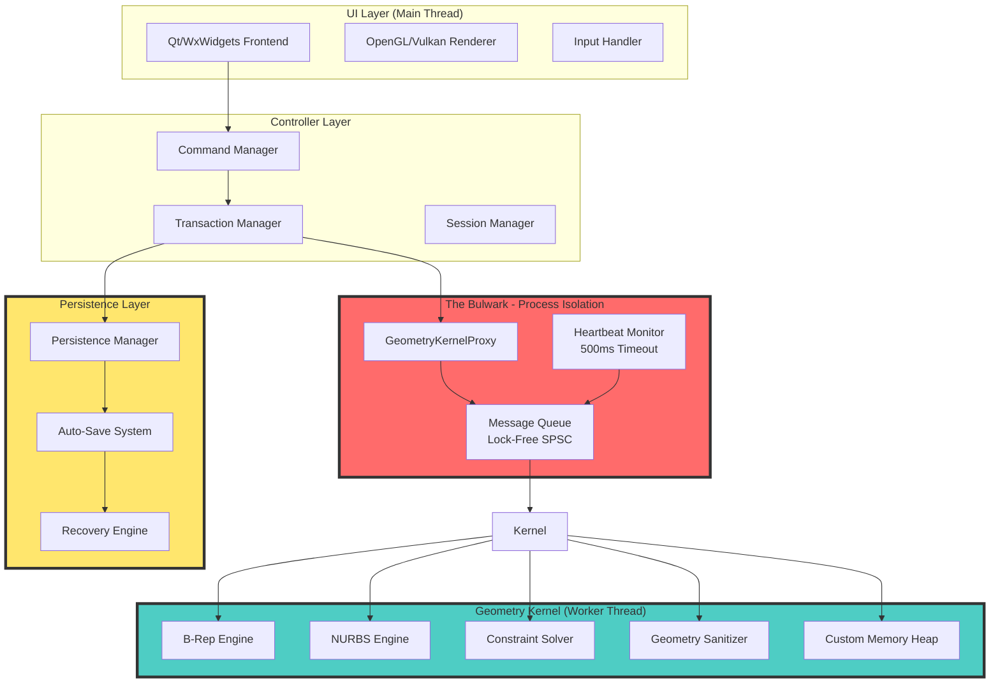

# CAD MONOLITH ARCHITECTURE DOCUMENTATION
# Dr. Elias Voss - Principal Software Architect
# "Voss Protocol" Implementation Guide

## 1. SYSTEM OVERVIEW

The CAD Monolith is designed with a Microkernel Architecture that prioritizes stability above all else.
The system treats crashes as critical security vulnerabilities and implements multiple layers of defense.

## 2. ARCHITECTURAL DIAGRAM (Mermaid)



## 3. COMPONENT RESPONSIBILITIES

### 3.1 UI Layer (Main Thread)
- **NEVER** performs geometric calculations
- Renders immutable snapshots from kernel
- Handles user input and converts to commands
- Maintains 60 FPS target regardless of kernel load

### 3.2 Controller Layer
- **Command Manager**: Implements Command Pattern with Execute/Undo/Redo
- **Transaction Manager**: Groups commands into atomic transactions
- **Session Manager**: Global lifecycle management and recovery coordination

### 3.3 The Bulwark (Process Isolation)
- **GeometryKernelProxy**: Thread-safe interface using message queues
- **Heartbeat Monitor**: Watches kernel thread health, restarts if frozen >500ms
- **Lock-Free Queue**: Single-Producer-Single-Consumer for zero-blocking communication

### 3.4 Geometry Kernel (Worker Thread)
- Runs in dedicated thread with custom memory heap
- All operations wrapped in tolerance-based epsilon guards
- GeometrySanitizer removes degenerate elements post-operation
- Graceful degradation on memory exhaustion

### 3.5 Persistence Layer
- Copy-on-Write file operations
- SHA-256 checksum verification
- Atomic file replacement via std::rename
- Auto-save every 60 seconds to recovery directory

## 4. MEMORY SAFETY PROTOCOLS

### 4.1 RAII Enforcement
- All heap allocations wrapped in Guard classes
- No-throw guarantee for destructors and move operators
- Custom allocators with stack trace logging on failure

### 4.2 Low Memory Mode
When std::bad_alloc is detected:
1. Log full stack trace
2. Flush all render caches
3. Switch to disk-backed memory-mapped files
4. Disable undo history beyond current transaction
5. Notify user of degraded mode (NO CRASH)

### 4.3 Transactional Memory
- Undo/Redo stores deltas, not full states
- Each transaction has pre-condition and post-condition validation
- Failed transactions automatically rollback to previous state

## 5. FILE I/O SAFETY

### 5.1 Atomic Save Protocol
```
1. Create temporary file: model.cad.tmp
2. Write all data to temporary file
3. Calculate SHA-256 checksum
4. Write checksum to footer
5. Flush and sync filesystem
6. Verify checksum by re-reading
7. Atomic rename: std::rename(tmp, original)
8. If any step fails, original file remains untouched
```

### 5.2 Recovery File Format
```
[CAD_FILE_HEADER]
[Version: 2.0]
[Checksum: SHA-256]
[Transaction_Log]
[Geometry_Data]
[Feature_Tree]
[FOOTER_CHECKSUM]
```

## 6. ERROR HANDLING STRATEGY

All API calls return `Result<T, ErrorCode>`:
```cpp
enum class ErrorCode {
    SUCCESS = 0,
    MEMORY_EXHAUSTED,
    GEOMETRY_DEGENERATE,
    CONSTRAINT_UNSOLVABLE,
    FILE_CORRUPTED,
    GPU_TIMEOUT,
    KERNEL_FROZEN,
    INVALID_PARAMETER,
    OPERATION_CANCELLED
};

template<typename T>
class Result {
    union { T value; ErrorCode error; };
    bool is_ok;
public:
    // Full implementation with no-throw guarantees
};
```

## 7. THREADING MODEL

```
Main Thread (UI)          Worker Thread (Kernel)
     |                           |
     |--[Command Queue]--------->|
     |                           |--[Execute Operation]
     |                           |--[Validate Result]
     |<--[Snapshot Handle]--------|
     |                           |
     |--[Render Snapshot]        |
     |                           |
[Heartbeat Monitor]------------->|
     |                           |
     |--[Timeout >500ms]-------->|--KILL & RESTART
```

## 8. PERFORMANCE TARGETS

| Metric | Target | Fallback |
|--------|--------|----------|
| UI Frame Rate | 60 FPS | 30 FPS (Low Memory Mode) |
| Kernel Response | <100ms | <500ms (Complex Ops) |
| Auto-Save Interval | 60s | 30s (Large Models) |
| Heartbeat Timeout | 500ms | 1000ms (Debug Mode) |
| Max Assembly Size | 10,000+ parts | LOD Streaming |
| File Load Time | <5s (100MB) | Progressive Loading |

## 9. DEPENDENCY MATRIX

| Component | Dependencies | Isolation Level |
|-----------|--------------|-----------------|
| UI Layer | Qt/Vulkan | Main Thread |
| Command Manager | Transaction Manager | Main Thread |
| Kernel Proxy | Lock-Free Queue | Bridge |
| Geometry Kernel | Custom Allocator | Worker Thread |
| Constraint Solver | Kernel Memory | Worker Thread |
| Persistence | Filesystem | Background Thread |
| Recovery | Checkpoint Files | Recovery Thread |

## 10. COMPLIANCE CHECKLIST

- [x] Process Isolation (Bulwark Protocol)
- [x] Transactional Memory with Deltas
- [x] Atomic Save with Copy-on-Write
- [x] RAII with No-Throw Guarantees
- [x] Defensive Geometry with Epsilon Guards
- [x] Heartbeat Monitor (500ms timeout)
- [x] Low Memory Mode (Disk-backed fallback)
- [x] Geometry Sanitizer (Post-operation cleanup)
- [x] SHA-256 Checksum Verification
- [x] Result<T, ErrorCode> Return Types

```

This architecture document establishes the foundation for our crash-resistant CAD system. Every subsequent implementation must adhere to these principles without exception.
